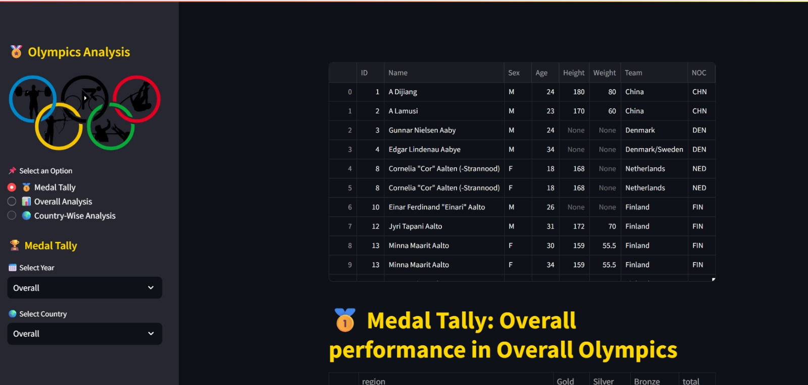

<h1 align="center">🏅 Olympic Analysis Project</h1>

<p align="center">
  <a href="https://www.python.org/"></a>
  <a href="LICENSE"></a>
  <a href="https://github.com/Abhi12002/Olympic-Analysis-Project/stargazers"></a>
</p>

---
<a name="table-of-contents"></a>
## 📑 Table of Contents

- [📝 Project Overview](#project-overview)
- [🖼️ Demo](#demo)
- [🚀 Features](#features)
- [🛠️ Technologies Used](#technologies-used)
- [📊 Dataset](#dataset)
- [🧹 Data Exploration & Feature Engineering](#data-exploration-and-feature-engineering)
- [🏗️ Technical Architecture & Workflow](#technical-architecture-and-workflow)
- [⚙️ Installation and Setup](#installation-and-setup)
- [💡 Usage](#usage)
- [🗂️ Project Structure](#project-structure)
- [🧪 Testing & Validation](#testing-and-validation)
- [🚧 Limitations & Challenges](#limitations-and-challenges)
- [🛣️ Future Work](#future-work)
- [🤝 Contributing](#contributing)
- [📜 License](#license)
- [🙏 Acknowledgments](#acknowledgments)
- [📬 Contact](#contact)

---

<a name="project-overview"></a>
## 📝 Project Overview

**Olympic Analysis Project** is an interactive analytics dashboard that provides comprehensive insights into 120+ years of Olympic Games data (1896–2016).  
Built with **Python, Streamlit, Pandas, and Plotly**, it enables users to explore medal tallies, country-wise performance, athlete statistics, and Olympic trends through an intuitive web interface.

---

<a name="demo"></a>
## 🖼️ Demo

| Olympics Analysis Dashboard |
|:--------------------------:|
|  |

---

<a name="features"></a>
## 🚀 Features

- **Medal Tally:** Filter by year and country; analyze performance across Olympic Games.
- **Overall Analysis:**  
  - Top statistics: Most successful countries and athletes  
  - Participation trends by nation and gender  
  - Number of events and athletes over time  
  - Event heatmaps by sport and year  
  - Most successful athletes (with sport filter)
- **Country-Wise Analysis:**  
  - Medal analysis for individual countries  
  - Country-sport heatmap  
  - Most successful athletes by country
- **Athlete Analysis:**  
  - Age distributions (overall, medalists, by sport/medal type)  
  - Men vs. women participation over time
- **User-Friendly UI:**  
  - Interactive filters and charts  
  - Real-time updates with Streamlit widgets

---

<a name="technologies-used"></a>
## 🛠️ Technologies Used

- **Python 3.8+**
- **Streamlit** (dashboard & UI)
- **Pandas** (data manipulation)
- **Plotly** (interactive visualizations)

---

<a name="dataset"></a>
## 📊 Dataset

- **Source:** ["120 Years of Olympic History: Athletes and Results"](https://www.kaggle.com/datasets/heesoo37/120-years-of-olympic-history-athletes-and-results)
- **Period:** 1896–2016
- **Records:** 271,116 rows, 15 columns (athlete names, countries, sports, events, medals, etc.)
- **Supplement:** `noc_regions.csv` for NOC-country mapping

---

<a name="data-exploration-and-feature-engineering"></a>
## 🧹 Data Exploration & Feature Engineering

**Data Cleaning:**
- Removed duplicate athlete-event records.
- Handled missing values in `Age`, `Height`, and `Weight` (imputed with median or dropped if excessive).
- Standardized country names using `noc_regions.csv`.

**Feature Engineering:**
- Created `Age Group` buckets: `<20`, `20-30`, `30-40`, `>40`.
- Added `Decade` column to analyze trends over time.
- Encoded categorical variables (`Sport`, `Medal`, `Sex`) for easier analysis.
- Created participation and medal count aggregates by country, year, and sport.

**Exploratory Data Analysis:**
- Discovered that the number of participating countries and athletes has grown steadily.
- Noted a significant increase in women’s participation, especially after 1980.
- Identified top-performing countries and athletes by medal count.
- Found that certain sports (e.g., Athletics, Swimming) dominate the medal tallies.

---

<a name="technical-architecture-and-workflow"></a>
## 🏗️ Technical Architecture & Workflow

The project is organized for modularity and clarity:

- **Data Ingestion:** Loads and merges `athlete_events.csv` and `noc_regions.csv`.
- **Preprocessing:** Cleans data, handles missing values, and creates new features.
- **Analysis Modules:**  
  - `helper.py` contains reusable functions for medal tallies, trends, and athlete stats.
  - `preprocessor.py` handles all data cleaning and feature engineering.
- **Dashboard UI:**  
  - `app.py` orchestrates the Streamlit interface, widgets, and visualizations.
  - Users interact via sidebar filters (year, country, sport, etc.).
- **Visualization:**  
  - Plotly generates interactive charts (bar, line, heatmap, boxplots).
  - All charts update in real-time as filters are changed.
- **Performance:**  
  - Uses Streamlit caching to avoid redundant computations.

**Workflow Diagram:**

<pre>
[CSV Data] → [Preprocessing] → [Feature Engineering] → [Helper Functions] → [Streamlit UI] → [Interactive Visualizations]
</pre>

---

<a name="installation-and-setup"></a>
## ⚙️ Installation and Setup

1. **Clone the Repository**
    ```
    git clone https://github.com/Abhi12002/Olympic-Analysis-Project.git
    cd Olympic-Analysis-Project
    ```
    
2. **Run the Application**
    ```
    streamlit run app.py
    ```
    The app will open in your default browser at [http://localhost:8501](http://localhost:8501).

---

<a name="usage"></a>
## 💡 Usage

- Use the sidebar to navigate between dashboard sections.
- Apply filters (year, country, sport, etc.) to customize visualizations.
- Explore medal tallies, trends, and athlete stats interactively.
- Hover over charts for detailed tooltips.

---

<a name="project-structure"></a>
## 🗂️ Project Structure

<pre>
Olympic-Analysis-Project/
├── app.py              # Main Streamlit app
├── preprocessor.py     # Data cleaning and feature engineering
├── helper.py           # Utility functions for analysis/visualization
├── athlete_events.csv  # Main dataset
├── noc_regions.csv     # NOC code to country/region mapping
├── Olympics-photo.jpg
└── README.md
</pre>

**Descriptions:**
- `app.py`: Initializes and runs the Streamlit dashboard
- `preprocessor.py`: Cleans and prepares the dataset
- `helper.py`: Helper functions for stats and plots
- `athlete_events.csv`: Primary dataset
- `noc_regions.csv`: Supplementary NOC-country mapping
- `screenshots/`: Images used in documentation

---

<a name="testing-and-validation"></a>
## 🧪 Testing & Validation

- **Code tested** with multiple data slices (years, countries, sports) to ensure accuracy of aggregates and filters.
- **Manual validation** of medal tallies and athlete counts against official Olympic records.
- **Streamlit caching** tested for performance and efficiency.
- **Cross-browser testing** for UI consistency.

---

<a name="limitations-and-challenges"></a>
## 🚧 Limitations & Challenges

- **Data Limitations:**  
  - Some athlete records have missing or inconsistent values (especially for early Olympics).
  - Medal counts for team events may be duplicated for each team member.
- **Performance:**  
  - Large data slices may cause minor lag in the dashboard.
- **Visualization:**  
  - Some charts can become cluttered with too many categories (e.g., all sports at once).
- **Deployment:**  
  - Streamlit apps are best suited for analytics dashboards, not for high-traffic production APIs.

---

<a name="future-work"></a>
## 🛣️ Future Work

- Add more advanced analytics (e.g., medal prediction, clustering athletes by performance).
- Integrate more granular filters (e.g., by athlete name, event type).
- Deploy as a public web app (Streamlit Cloud or Hugging Face Spaces).
- Add user authentication for saving favorite views.
- Expand to include Winter Olympics data and recent years.

---

<a name="contributing"></a>
## 🤝 Contributing

Contributions are welcome!  
If you have ideas for features, improvements, or bug fixes:
1. Fork the repository
2. Create a new branch
3. Submit a pull request

Please ensure your changes align with project goals and code quality standards.

---

<a name="license"></a>
## 📜 License

This project is licensed under the **MIT License**.

---

<a name="acknowledgments"></a>
## 🙏 Acknowledgments

- **Dataset:** ["120 Years of Olympic History: Athletes and Results"](https://www.kaggle.com/datasets/heesoo37/120-years-of-olympic-history-athletes-and-results)
- **Tools:** Thanks to the developers of Streamlit, Pandas, and Plotly for their powerful open-source libraries.
- **Community:** Gratitude to the data science and open-source community for inspiration and guidance.

---

<a name="contact"></a>
## 📬 Contact

**Abhinav Mishra**  
[LinkedIn](https://www.linkedin.com/in/abhinav-mishra-4b72b120b/)  
[GitHub](https://github.com/Abhi12002)

---

*If you found this project useful, please ⭐️ star the repo and share your feedback!*
